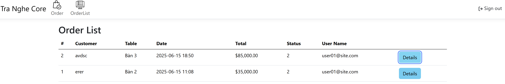

## TraNgheCore

An ASP.NET Core MVC application with Areas (`Admin`, `User`) built on Entity Framework Core + ASP.NET Identity for role‑based access. It manages products, categories, tables, orders (with items, statuses, types), and users. Includes AJAX order detail modal, dynamic multi‑item order form, currency formatting, Select2 integration, cookie expiration tuning, and Google reCAPTCHA (securely configured).
---
* Inspired by FnB (tea shop / fast food) operations.
* Personal learning project; may expand (reports, dashboards, UI polish, etc.).
- The application is only for personal coding practicing purpose. I'll probably expand its scope (e.g. reports, UI enhancements,...) in the future to learn more about .NET MVC.
* Role-based access (Admin vs User).
* User & Role management.
* Category & Product CRUD.
* Order creation with dynamic item rows, live totals, thousand separators (VND formatting).
* AJAX order details modal.
* EF Core migrations + auto migration hook.
* Authentication cookie timeout + sliding expiration.
* Google reCAPTCHA for login abuse mitigation (keys via secrets / env / Azure config).
* Select2 + Bootstrap 5 themed product dropdowns.
- Google reCAPTCHA (login hardening).
| Layer | Technology |
|-------|------------|
| Web   | ASP.NET Core 9 MVC |
| Data  | Entity Framework Core / SQL Server (LocalDB or Azure) |
| Auth  | ASP.NET Identity (roles) |
| UI    | Bootstrap 5, jQuery, Select2 |
| Security | reCAPTCHA v2 (checkbox) |
- SQL Server (LocalDB)
```text
Areas/
	Admin/
		Controllers/ (CategoryController, ProductController, UserController, RoleController ...)
		Views/
	User/
		Controllers/ (OrderListController, etc.)
		Views/
Controllers/ (AccountController, HomeController)
Data/ (ApplicationDbContext.cs)
Models/ (ProductModel, OrderModel, OrderItemModel, ViewModels ...)
Views/Shared/_Layout.cshtml
wwwroot/ (css, js, images, libs)
IdentitySeeder.cs
Program.cs
Migrations/
```
Models/ (ProductModel, OrderModel, OrderItemModel, ViewModels ...)
Views/Shared/_Layout.cshtml
* .NET 9 SDK
* SQL Server (LocalDB or full / Azure SQL)
Program.cs
```bash
git clone <your-repo-url>
cd tra-nghe-netcore
dotnet restore
```
---
"ConnectionStrings": {
	"DefaultConnection": "Server=(localdb)\\\\MSSQLLocalDB;Database=TraNgheCoreDb;Trusted_Connection=True;MultipleActiveResultSets=true;TrustServerCertificate=True"
}
```
#### reCAPTCHA (secure key loading)
Preferred (user-secrets):
```bash
dotnet user-secrets init
dotnet user-secrets set "ReCaptcha:SiteKey" "YOUR_SITE_KEY"
dotnet user-secrets set "ReCaptcha:SecretKey" "YOUR_SECRET_KEY"
```
Alternative `.env` (NOT committed):
```env
ReCaptcha__SiteKey=YOUR_SITE_KEY
ReCaptcha__SecretKey=YOUR_SECRET_KEY
```
### Prerequisites
```bash
dotnet run
```
Browse: `https://localhost:<port>` (see console output for exact port).
### Clone & Restore

git clone <your-repo-url>
cd tra-nghe-netcore
dotnet restore


### Configuration
Edit `appsettings.Development.json`:

"ConnectionStrings": {
	"DefaultConnection": "Server=(localdb)\\MSSQLLocalDB;Database=TraNgheCoreDb;Trusted_Connection=True;MultipleActiveResultSets=true;TrustServerCertificate=True"
}

Add `.env` file:
ReCaptcha__SiteKey=YOUR_SITE_KEY
ReCaptcha__SecretKey=YOUR_SECRET_KEY

### Run the App

dotnet run

Navigate to: `https://localhost:5119`

---

## Some demos

### Sign in


### Admin View

#### Product Management


#### Category Management


#### Table Management


#### Type of Order


#### User Management


### Usual User View

#### Order Creation


#### Order Management



