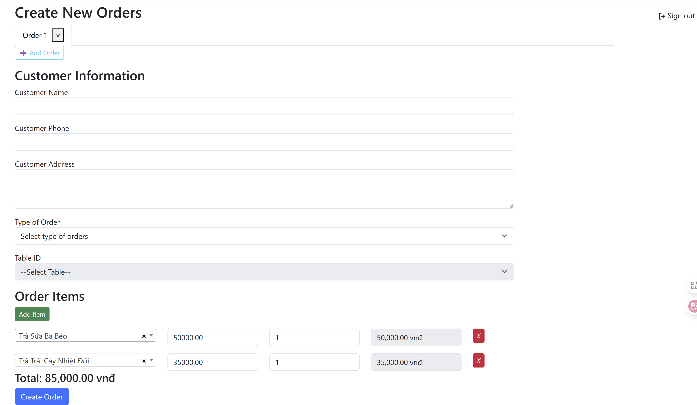

## TraNgheCore

An ASP.NET Core MVC application with Areas (`Admin`, `User`) using Entity Framework Core + ASP.NET Identity for role‑based access (Admin vs User). It manages products, categories, tables, orders (with order items + statuses + type of order), and users. Includes AJAX order detail modal, dynamic order creation form, currency formatting, Select2 integration, and Google reCAPTCHA support.

---
## Scope:

- The application is inspired from FnB applications used in several service businesses such as: boba tea shop, fast-food restaurants, etc.
- The application is only for personal coding practicing purpose. I'll probably expand its scope (e.g. reports, UI enhancements,...) in the future to learn more about .NET MVC.

---
## ✨ Features
- Role-based access.
- User management: create users, assign roles.
- Category & Product management.
- Order creation with multiple order items (dynamic rows, live totals, thousand separators, VND formatting).
- Entity Framework Core Migrations (SQL Server).
- Authentication cookie timeout configuration & sliding expiration.
- Google reCAPTCHA (login hardening).
- Select2 + Bootstrap 5 themed product selection.

---
## 🧱 Tech Stack
- .NET 9.0 / ASP.NET Core MVC
- Entity Framework Core
- ASP.NET Identity
- SQL Server (LocalDB)
- Bootstrap 5, jQuery, Select2
- Google reCAPTCHA

---
## 📁 Project Structure

Areas/
	Admin/
		Controllers/ (CategoryController, ProductController, UserController, RoleController ...)
		Views/
	User/
		Controllers/ (OrderListController, etc.)
		Views/
Controllers/ (AccountController, HomeController)
Data/ (ApplicationDbContext.cs)
Models/ (ProductModel, OrderModel, OrderItemModel, ViewModels ...)
Views/Shared/_Layout.cshtml
wwwroot/ (css, js, images, libs)
IdentitySeeder.cs
Program.cs

---
## 🚀 Getting Started
### Prerequisites
- .NET 9 SDK
- SQL Server (LocalDB or full instance)

### Clone & Restore

git clone <your-repo-url>
cd tra-nghe-netcore
dotnet restore

### Configuration
Edit `appsettings.Development.json`:

"ConnectionStrings": {
	"DefaultConnection": "Server=(localdb)\\MSSQLLocalDB;Database=TraNgheCoreDb;Trusted_Connection=True;MultipleActiveResultSets=true;TrustServerCertificate=True"
}

Add `.env` file:
ReCaptcha__SiteKey=YOUR_SITE_KEY
ReCaptcha__SecretKey=YOUR_SECRET_KEY

### Run the App

dotnet run

Navigate to: `https://localhost:5119`

---

## Some demo

### Sign in

### Admin View

#### Product Management

#### Category Management

#### Table Management

#### Type of Order

#### User Management

### Usual User View

#### Order Creation

#### Order Management

